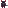

# The Roster — PIOSI Characters

25 heroes. Each brings a distinct combat identity shaped by one or two signature stats. Understanding what each hero *does* is more important than their raw numbers — a hero with 1 attack and the right ability can flip a battle.

---

## How to read a stat block

| Stat | What it does |
|---|---|
| **ATK** | Damage dealt per attack |
| **RNG** | How many cells the attack ray travels |
| **AGI** | Move points per turn (higher = more moves) |
| **HP** | Health points |
| **Signature stats** | See each hero's entry — these drive unique mechanics |

**Mode Up** happens between levels: the party picks one hero, and *every* hero gains that hero's buff scaled by the current level number.

---

## Frontliners

Heroes built to absorb damage and hit hard at close range.

---

### Knight  `♞`

**ATK 4 | RNG 1 | AGI 4 | HP 18**

The baseline warrior. High health, solid attack, enough agility to stay mobile. No gimmicks — just reliable melee damage with room to grow.

**Mode Up:** `+ATK` and `+HP` — the party gets tougher and hits harder every level.

*Best when:* you want a dependable anchor who improves predictably. Good first pick for new parties.

---

### Berserker  `⚒`

**ATK 6 | RNG 1 | AGI 3 | HP 20 | Rage 1**

The highest base attack in the game. Slow, but doesn't need to be fast — it only takes one hit from Berserker to matter.

**Rage:** Every time an enemy lands a hit on Berserker, a random stat increases by the Rage value. Getting hit makes him stronger.

**Mode Up:** `+ATK` and `+Rage` — hits harder and escalates faster the more punishment he takes.

*Best when:* you want a damage spike and don't mind tanking hits to fuel it. Pairs well with healers who can keep him alive long enough to snowball.

---

### Meatwalker  `₻`

**ATK 7 | RNG 1 | AGI 2 | HP 22 | Heal 1 | Bulk 1**

The heaviest hitter in the roster. Moves like a glacier but swings like a wrecking ball. The slight Heal stat means he occasionally patches himself up.

**Bulk:** A secondary growth stat that scales with Mode Up.

**Mode Up:** `+Bulk` — deepens his durability.

*Best when:* you need maximum single-hit damage and can route enemies toward him rather than chasing them.

---

### Palisade  `ᱟ`

**ATK 3 | RNG 1 | AGI 2 | HP 20 | Armor 5**

The tank. Armor absorbs incoming damage before HP takes a scratch. At Armor 5, Palisade can soak five full hits before the party starts losing real health.

**Armor:** Acts as a damage shield — each point of armor absorbs one hit. Armor depletes; HP doesn't drop until armor is gone.

**Mode Up:** `+Armor` — the shield regenerates and grows every level.

*Best when:* enemies are clustered and hitting your frontline hard. Position Palisade to draw fire while your ranged heroes work safely.

---

### Slüjier  `🜜`

**ATK 5 | RNG 1 | AGI 4 | HP 16 | Sluj 1**

Fast melee with a toxic signature. Every hit applies a stacking damage-over-time effect that grows more dangerous the more times an enemy is struck.

**Slüj:** Applies a DoT to enemies. Each subsequent hit on the same enemy stacks the Slüj level higher, increasing damage frequency. The effect ticks on a timer — the higher the level, the faster it fires.

**Mode Up:** `+Slüj` — the DoT escalates more aggressively.

*Best when:* enemies have high HP. Hit the same target repeatedly to ramp the poison before switching to the next.

---

### Greenjay  `࿈`

**ATK 5 | RNG 2 | AGI 4 | HP 30 | Rise 5**

The unkillable. Greenjay has the highest HP in the game and, crucially, comes back from the dead.

**Rise:** When Greenjay would die, Rise triggers instead — Greenjay resurrects with HP equal to the Rise value rather than receiving a permanent death marker. Rise is then spent.

**Mode Up:** `+Rise` — replenishes the resurrection value, keeping the rebirth available.

*Best when:* you're in a war of attrition and need a hero who refuses to stay down. Also useful for Mode Up passes — choosing Greenjay buffs the party with extra resurrection insurance.

---

## Ranged Strikers

Heroes with long attack rays who prefer distance.

---

### Archer  `⚔`

**ATK 3 | RNG 5 | AGI 4 | HP 12**

Long range, fast, fragile. The Archer can threaten enemies across most of the battlefield without entering danger range.

**Mode Up:** `+Range` — extends reach further each level until almost no position is safe for enemies.

*Best when:* you can keep the Archer behind the frontline. Watch the HP — one enemy closing the gap is a crisis.

---

### Wizard  `✡`

**ATK 2 | RNG 7 | AGI 2 | HP 10 | Chain 5**

The longest range in the game — nearly the full map width. Low attack and terrible mobility, but Chain turns every hit into a multi-target event.

**Chain:** When an attack hits, Chain damage arcs to enemies adjacent to the target. The chain multiplier scales with the Chain stat using a diminishing-returns formula — high Chain can nearly double effective damage across clustered groups.

**Mode Up:** `+Chain` — AoE grows stronger every level.

*Best when:* enemies are packed together. Protect the Wizard at all costs — it cannot survive being reached.

---

### Soothscribe  `☄`

**ATK 2 | RNG 6 | AGI 3 | HP 11 | Fate 1**

Long-range oracle. Lower output than the Archer or Wizard individually, but the Fate stat adds a layer of unpredictability to the battlefield.

**Fate:** Grows with Mode Up. Exact effect scales with stat value.

**Mode Up:** `+Fate` — fate compounds over levels.

*Best when:* paired with high-damage frontliners who can capitalize on debilitated enemies.

---

## Skirmishers

Mobile heroes who hit from unexpected angles.

---

### Rogue  `☠`

**ATK 4 | RNG 2 | AGI 6 | HP 12**

The fastest hero. Six move points per turn means the Rogue can cross the map, land multiple attacks, and retreat — all in one turn if positioned well.

**Mode Up:** `+Agility` — already the fastest, gets faster. At high levels the Rogue can lap the battlefield.

*Best when:* you need to reach isolated enemies quickly or evacuate a hero from danger. Fragile in sustained engagements.

---

### Yeetrian  `⛓`

**ATK 3 | RNG 2 | AGI 4 | HP 14 | Yeet 1**

Crowd control specialist. Yeetrian doesn't just damage enemies — it sends them flying.

**Yeet (Knockback):** Successful attacks push the enemy along the attack vector. Enemies collide with walls or map boundaries taking additional damage. Higher Yeet means longer knockback distance.

**Mode Up:** `+Yeet` — enemies get launched further each level.

*Best when:* enemies are near walls. Yeet them into the wall for the collision bonus. Also useful for separating clustered groups or clearing a path.

---

### Bombador  `❦`

**ATK 2 | RNG 1 | AGI 6 | HP 20 | Bomba 5**

A reaction fighter. Bombador's own attacks are modest — the power comes from being adjacent to enemies when *other heroes* attack them.

**Bomba:** Whenever another hero attacks an enemy adjacent to Bombador, Bombador automatically deals bonus damage equal to the Bomba stat. This fires without spending a turn.

**Mode Up:** `+Bomba` — the reaction damage grows each level.

*Best when:* kept close to the action without being the primary attacker. Position Bombador next to high-priority enemies and let your damage dealers trigger the bonus repeatedly.

---

### Sysiphuge  `₾`

**ATK 4 | RNG 1 | AGI 4 | HP 16 | Dodge 4**

Evasive melee fighter. Sysiphuge hits hard and ducks often.

**Dodge:** Each point of Dodge increases the chance to avoid incoming attacks, using a diminishing-returns formula capped at 50%. At Dodge 4, Sysiphuge evades roughly 40% of attacks from the start.

**Mode Up:** `+Dodge` — evasion climbs toward the cap.

*Best when:* you want a melee hero who can survive deep in enemy lines longer than expected.

---

## Support & Utility

Heroes who strengthen allies, manipulate enemies, or provide unique battlefield effects.

---

### Cleric  `✝`

**ATK 2 | RNG 1 | AGI 3 | HP 12 | Heal 4**

The party's healer. Low attack, but attacking in the direction of a wounded ally restores HP rather than dealing damage.

**Heal:** The amount restored to an ally per heal action. At Heal 4, this is meaningful recovery mid-battle.

**Mode Up:** `+Heal` × 2 — healing scales faster than any other Mode Up, making the Cleric dramatically stronger in later levels.

*Best when:* party members are taking consistent damage. Keep the Cleric adjacent to your frontline and spend turns healing between waves.

---

### Shrink  `☊`

**ATK 2 | RNG 1 | AGI 3 | HP 12 | Psych 1**

Psychological support. Low individual combat output, but each Shrink attack buffs an ally.

**Psych:** On a successful attack, boosts a random stat on a random living ally by the Psych value. This compounds over a long battle into meaningful stat inflation across the party.

**Mode Up:** `+Psych` — the random buff magnitude grows.

*Best when:* battles run long. Shrink's value is cumulative — the earlier you bring Shrink, the more buffs accumulate.

---

### Mellitron  `丰`

**ATK 1 | RNG 3 | AGI 5 | HP 18 | Swarm 2**

Passive area damage. Mellitron's direct attack is negligible, but the Swarm stat makes every enemy who gets close pay automatically.

**Swarm:** At the end of each turn, all enemies in the 8 cells surrounding Mellitron take Swarm damage. This fires without any action — just by existing near enemies.

**Mode Up:** `+Swarm` — passive damage per tick increases.

*Best when:* enemies funnel toward your position. Park Mellitron in a chokepoint and let the swarm do the work.

---

### Gastronomer  `𑍐`

**ATK 2 | RNG 1 | AGI 3 | HP 15 | Spicy 1**

Forager. The Gastronomer doesn't fight particularly well, but turns battlefield pickups into a resource engine.

**Spicy:** Increases the HP restored when a hero picks up a vittle (food item on the battlefield). Each point of Spicy adds 2 extra HP to every vittle heal for the whole party.

**Mode Up:** `+Spicy` — vittles become progressively more powerful.

*Best when:* the level has vittles scattered across it. Gastronomer turns incidental pickups into significant sustain.

---

### Mycelian  `ৡ`

**ATK 2 | RNG 1 | AGI 3 | HP 15 | Spore 1**

Mushroom forager. Mycelian's Spore stat supercharges mushroom pickups on the battlefield.

**Spore:** When a hero picks up a mushroom, they gain a random stat boost. The higher the Spore value, the more powerful that boost becomes.

**Mode Up:** `+Spore` — mushroom upgrades scale up.

*Best when:* the level has mushroom items. Pairs well with Gastronomer if you want to maximize all battlefield pickups.

---

## Special / Lore Heroes

Unusual heroes with unorthodox mechanics or exceptional design space.

---

### Jester  `♣`

**ATK 3 | RNG 2 | AGI 5 | HP 10 | Trick 1**

Chaotic debuffer. The Jester attacks enemies' stats directly, reducing their effectiveness over time.

**Trick:** Each successful attack reduces a random enemy stat by the Trick value. Weakened enemies deal less damage, move less, or lose range — the effect is random but always degrades the target.

**Mode Up:** `+Trick` — debuffs land harder each level.

*Flavor:* Brings a joke to the party selection screen via live API.

*Best when:* facing tanky enemies or bosses. Sustained Trick applications can reduce a dangerous enemy to a non-threat.

---

### Torcher  `⚶`

**ATK 4 | RNG 2 | AGI 3 | HP 14 | Burn 1**

Fire damage specialist. Solid direct attack plus a DoT that activates passively after the hit lands.

**Burn:** Applies a burning status to hit enemies. Burn ticks for damage over 3 turns, then expires. Unlike Slüj, Burn is fixed-duration rather than stacking.

**Mode Up:** `+Burn` — fire damage per tick increases.

*Best when:* you want set-and-forget damage while moving to the next target. Hit an enemy, let them burn, move on.

---

### Kemetic  `𓋇`

**ATK 5 | RNG 5 | AGI 5 | HP 25 | Ankh 5**

The most balanced elite hero. High stats across every dimension — but the Ankh mechanic makes Kemetic uniquely powerful in adversity.

**Ankh:** When Kemetic dies, every surviving ally gains a random stat boost equal to the Ankh value. Death becomes a buff delivery.

**Mode Up:** `+Ankh` — the death bonus grows each level.

*Best when:* you're willing to treat Kemetic as a sacrifice piece in later levels. The Ankh payout can dramatically power up the rest of the party at a critical moment.

---

### Nonsequiteur  `∄`

**ATK 3 | RNG 3 | AGI 3 | HP 10 | Caprice 1**

Unpredictable wildcard. Average stats in every column with a signature built around randomness.

**Caprice:** Randomly increments a stat when triggered. The effect is deliberately erratic — Nonsequiteur might boost anything.

**Mode Up:** `+Caprice` — chaos magnitude increases.

*Flavor:* Fetches random non-sequitur facts from an external API during party select.

*Best when:* you want variance. Sometimes Nonsequiteur snowballs into something terrifying. Sometimes it doesn't. That's the point.

---

### Sycophant  `♟`

**ATK 0 | RNG 0 | AGI 2 | HP 15**

Starts with nothing. Literally — zero attack, zero range. The Sycophant cannot deal damage at the start of the game.

**Mode Up:** `+1 to every single stat` — the only hero with a universal buff. After one Mode Up at level 1, Sycophant has stats. After several, it can outpace heroes who started with advantages.

*Best when:* you're comfortable deadweighting one party slot in early levels in exchange for an exponentially scaling hero by level 4+. High risk, high ceiling.

---

### Griot  `℣`

**ATK 1 | RNG 1 | AGI 1 | HP 10**

The weakest combatant on paper. The Griot reacts to the history of the battle — its `reactsToHistory` flag means it generates narrative commentary based on what has happened during the run.

**Mode Up:** Default (`+Ghïs`) — no signature buff, uses the generic fallback.

*Flavor:* The Griot's responses evolve based on recorded battle interactions, read from a Markov chain trained on the game's narrative corpus.

*Best when:* you want flavor and lore, not optimization. The Griot is a storytelling character. It will not carry a fight.

---

### Pæg  `ꚤ`

**ATK 1 | RNG 1 | AGI 1 | HP 1 | Every special stat: 1**

One HP. The most dangerous character in the game if it survives a single turn.

Pæg carries every special stat simultaneously — Burn, Slüj, Heal, Yeet, Swarm, Spicy, Armor, Spore, Chain, Ghïs — all at value 1. It cannot take a single hit, but every attack it lands applies every mechanic in the game at once.

**Mode Up:** Default (`+Ghïs`).

*Best when:* you are willing to play extremely carefully. Pæg positioned safely behind a tank while attacking can stack multiple effects on a single enemy per hit. It is fragile beyond recovery — treat it like glass artillery.

---

## Quick Reference

| | Hero | ATK | RNG | AGI | HP | Signature |
|---|---|---|---|---|---|---|
|  | Knight | 4 | 1 | 4 | 18 | — |
|  | Archer | 3 | 5 | 4 | 12 | — |
|  | Wizard | 2 | 7 | 2 | 10 | Chain (AoE arc) |
|  | Berserker | 6 | 1 | 3 | 20 | Rage (gains stats when hit) |
|  | Rogue | 4 | 2 | 6 | 12 | — |
|  | Cleric | 2 | 1 | 3 | 12 | Heal (restores ally HP) |
|  | Jester | 3 | 2 | 5 | 10 | Trick (debuffs enemy stats) |
|  | Meatwalker | 7 | 1 | 2 | 22 | Bulk |
|  | Soothscribe | 2 | 6 | 3 | 11 | Fate |
|  | Nonsequiteur | 3 | 3 | 3 | 10 | Caprice (random stat growth) |
|  | Griot | 1 | 1 | 1 | 10 | Narrative flavor |
|  | Torcher | 4 | 2 | 3 | 14 | Burn (fixed DoT) |
|  | Slüjier | 5 | 1 | 4 | 16 | Slüj (stacking DoT) |
|  | Shrink | 2 | 1 | 3 | 12 | Psych (buffs random ally) |
|  | Sycophant | 0 | 0 | 2 | 15 | Mode Up buffs every stat |
|  | Yeetrian | 3 | 2 | 4 | 14 | Yeet (knockback) |
|  | Mellitron | 1 | 3 | 5 | 18 | Swarm (passive AoE aura) |
|  | Gastronomer | 2 | 1 | 3 | 15 | Spicy (vittles heal more) |
|  | Palisade | 3 | 1 | 2 | 20 | Armor (damage shield) |
|  | Mycelian | 2 | 1 | 3 | 15 | Spore (mushroom upgrades) |
|  | Pæg | 1 | 1 | 1 | 1 | Every stat at 1 |
|  | Kemetic | 5 | 5 | 5 | 25 | Ankh (buffs allies on death) |
|  | Greenjay | 5 | 2 | 4 | 30 | Rise (resurrects after death) |
|  | Sysiphuge | 4 | 1 | 4 | 16 | Dodge (evasion chance) |
|  | Bombador | 2 | 1 | 6 | 20 | Bomba (reaction damage) |

---

## Hero design philosophy

Before adding a new hero, run it through these questions:

**Does this hero do something no one else does?** The roster should be a collection of distinct mechanical identities. If the new hero's defining ability overlaps significantly with an existing one, either differentiate it further or reconsider whether the roster needs it. The design space between Torcher (fixed-duration DoT) and Slüjier (stacking DoT) is intentionally narrow but distinct. *(Warren Spector)*

**Is the Mode Up outcome compelling?** Every hero is chosen twice — once at party select and once at the Mode Up screen. A hero with a great combat identity but a weak Mode Up will always lose out to one where both moments feel good. The Mode Up should amplify the hero's identity, not just add generic stats. *(Miyamoto, Peter Molyneux)*

**Can the sprite communicate the mechanical identity?** A player who has never read this README should be able to look at the party select screen and form a rough sense of each hero's personality from the sprite alone. Aggression, fragility, speed, support — these should be readable in the visual. *(Jordan Mechner, Aarron Walter)*

**What does this hero teach the player?** The best additions expand the player's understanding of the game's systems. Pæg teaches how all stats interact simultaneously. Sycophant teaches how compounding buffs work over time. Kemetic teaches that death can be a strategic choice. A new hero that doesn't reveal something new about the engine's depth is just roster bloat. *(Ken Levine, Yu Suzuki)*

## Adding a new hero

See [`docs/hero-manifestation-guide.md`](../../docs/hero-manifestation-guide.md) for the full authoring guide. The short version:

1. Add a PNG here matching the name convention (`HeroName.png`)
2. Define the hero in `content/heroes.<pack>.json` with `"sprite": "assets/characters/HeroName.png"`
3. Add a `case "<id>":` block in `src/modeup.js`
4. Update this file with the new hero's entry and image
